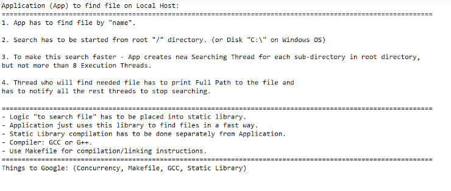

# Multithreaded File Search

Library for multithreading file search in a specified directory.

Compilation of the library and application is done separately in `CMakeLists.txt`.



## Compilation

1. Create a folder to store the compiled project:

    ```sh
    mkdir build
    cd build
    ```

2. Run cmake to build the project:

    ```sh
    cmake ..
    ```

3. Build the project using make:

    ```sh
    make
    ```

## Usage

To use the program, run the executable file located in the `build` folder, then input directory path and file name to search:

```sh
./GL_Application_Dmytro_Borak
```